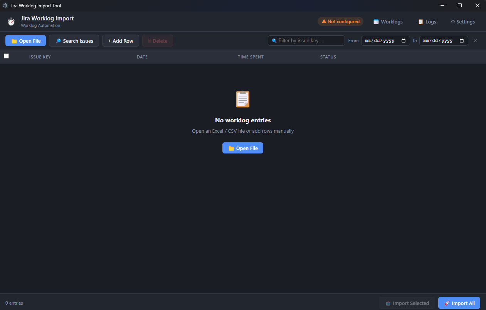
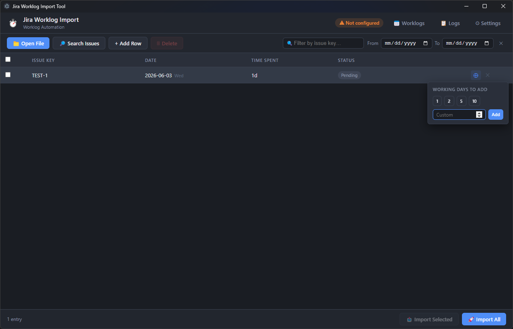

# Jira Worklog Import Tool

A desktop app for bulk-importing and managing Jira worklogs.

---

## Setup

Open **Settings** in the top-right corner and fill in your Jira URL, email address, and API token. Use **Test Connection** to verify the credentials before saving.

---

## Importing worklogs

### Loading entries

Click **Open File** to load an Excel or CSV file. The tool auto-detects common column names for issue key, date, and time spent. Rows missing an issue key are ignored.

Click **Add Row** to create a blank entry manually. Click any cell in the Issue Key, Date, or Time Spent columns to edit it inline. Press Enter to confirm or Escape to cancel.

Click **Search Issues** to search Jira by key or title fragment and add issues directly as new rows.

### Sending to Jira

- **Import All** — sends every row that has not already been marked as sent.
- **Import Selected** — sends only the checked rows.

Each row shows a status badge that updates live: Pending, Sending, Sent, or Error. Hovering an error badge shows the error message. A progress bar and counter are shown in the footer while importing.

---

## Working with rows

### Propagate to working days

Each row has a propagate button (visible on hover). Clicking it opens a popup where you pick how many working days to add — quick presets (1, 2, 5, 10) or a custom number. The tool creates copies of that row for each subsequent Monday-to-Friday day, inserting them directly below the source row.

### Delete rows

Click the delete button on a row to remove it. To remove multiple rows at once, check them and click **Delete** in the toolbar. The header checkbox selects or deselects all visible rows.

### Date column

The date column shows the day-of-week abbreviation next to the date for quick reference.

---

## Filtering and sorting

| Control | What it does |
|---|---|
| Issue key filter | Partial, case-insensitive match on the issue key column. |
| From / To date pickers | Hides rows outside the selected date range. |
| Clear button | Resets both the search and date filters. |
| Column headers (Issue Key, Date) | Click to sort ascending, click again to sort descending. |

Filters and sorting work together.

### Group by day

Click **Group by day** in the toolbar to group rows under day headers showing the date, day of the week, and the total time logged for that day. All editing, checkboxes, and propagate work the same in grouped mode. Click **Flat list** to return to the normal view.

---

## Viewing existing Jira worklogs

Click **Worklogs** in the header to open the worklog viewer.

Set the From and To dates and click **Load** to fetch all your worklogs from Jira for that period.

### Views

- **List** — default flat list of all entries.
- **Group by day** — entries grouped under day headers with the date, day of the week, and the day total. Click **List** to switch back.

### Search and sort

A search bar appears once worklogs are loaded. Typing filters rows in real time by partial issue key. Click any column header to sort ascending, again to sort descending, a third time to clear the sort.

### Delete

Each row has a delete button. Clicking it confirms and then permanently removes the worklog from Jira.

### Total time

The footer shows the total time logged across all visible entries.

---

## Import logs

Click **Logs** to view a history of every import session. Filter by status or work date. When no column sort is applied, entries are grouped by session showing how many were sent and how many failed per run. Clicking a column header sorts entries flat across all sessions. Click **Clear All Logs** to permanently remove the history.

---

## Updates

When a newer version is available an update banner appears at the top of the window. Click **Download** to save the new release zip to your Downloads folder. Once downloaded the button changes to **Open File**. Extract and replace the application folder to complete the update.

---

## Time format

Jira accepts time in natural language: `1h`, `30m`, `1h 30m`, `1d` (1 day = 8 hours by default).
